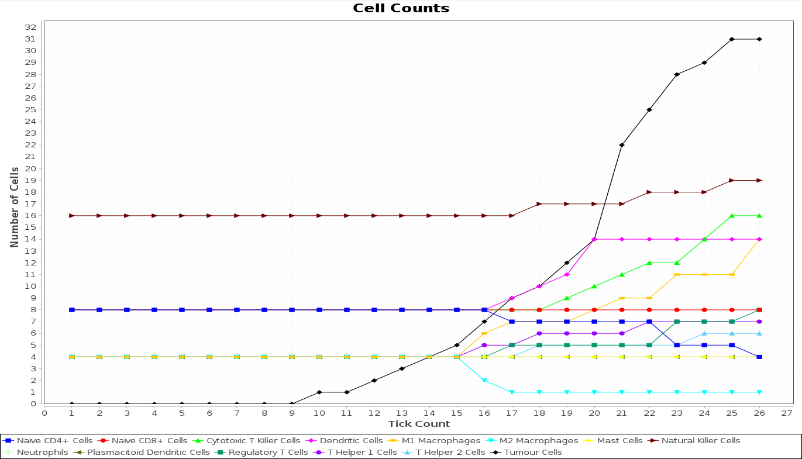
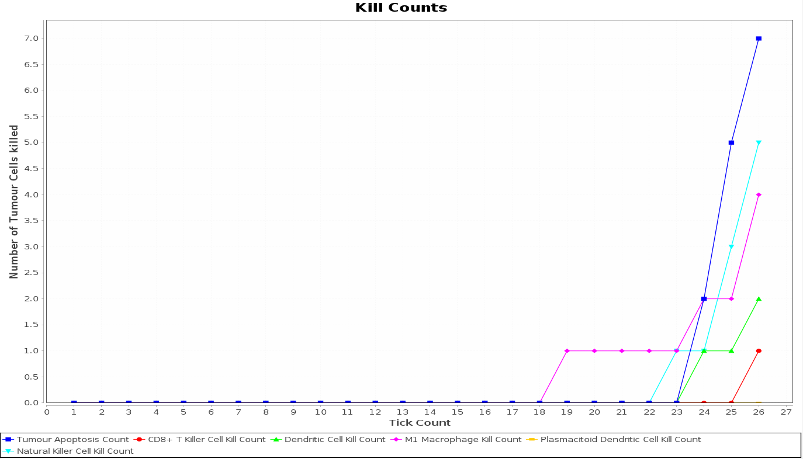

## OncoAgent

### Introduction

**OncoAgent** is a project developed by the *BioShape and Data Science Lab* of the University of Camerino (http://www.emanuelamerelli.eu/bigdata/doku.php?id=start). 

This project is aimed to provide a **simulator** that models the tumour micro-enviornment using **multiagent-based modeling**. In particular, agents' behaviour and environment have been modelled following the case study of the Renal Cell Carcinoma (RCC).  

Agents may execute various behaviours and can take choices based on the interaction with other agents or the environment. The surrounding environment is the context were agents live and interact with each other and it can influence the agents itself with its peculiar features. The theoretical model upon which this project is based on is a stochastic cellular automaton, and can be seen as a generalization of the late Conway’s Game of Life.

The software tool used to develop this system is The Repast Suite, a family of advanced, free, and open source agent-based modeling and simulation platforms. In particular it is used the Java implementation of it, *Repast Simphony 2.8*, downloadable from their official website at https://repast.github.io/ .

### Software Functionalities

* Possibility of changing parameters to influence simulation's outcome;
* 2D and 3D displays to visualize the tumour micro-environment;
* Real time charts for statistics such as _Cells Count_ and _Kill Count_ for each cell.

Moreover, Repast Simphony permits to add additional functionalities, such as exporting data in CSV files or adding custom charts. For more information, please check Repast official website https://repast.github.io/.

### Screenshots

2D Display             |  3D Display
:-------------------------:|:-------------------------:
  |  

### Pre-Requisites

In order to run the software, you should have Java 8 or a superior version installed on your machine.

### Installation

To install the software, clone the GitHub repository and follow the instructions provided in the *README* file.