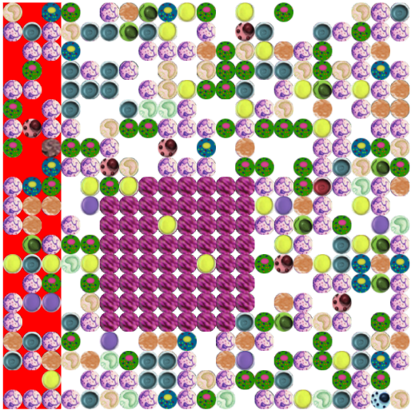

## Renal Cell Carcinoma Simulator

This project is aimed to provide a simulator of the immune response to RCC. It has been developed using the Java Repast Framework.

The user can tweak the model's parameters in order to change the simulation result. The simulator provides both 2D and 3D displays that show the tumour microenvironment where the immune response takes place.

2D Display             |  3D Display
:-------------------------:|:-------------------------:
  |  

It is possible to check real time charts for statistics such as Cells Count and Kill Count for each cell.

### Installation

To install the software, clone the GitHub repository and follow the instructions provided in the README file.